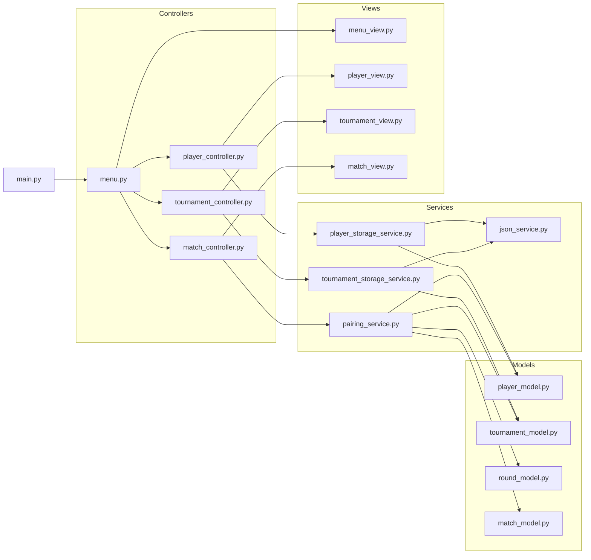

# Chess Tournament Manager

Application Python en **MVC & POO**  
Elle permet de **créer, gérer et suivre des tournois d’échecs** de manière simple, claire et organisée.

---

## Fonctionnalités principales
- **Gestion des joueurs** : ajout, suppression, listing.
- **Gestion des tournois** : création, sauvegarde, chargement depuis JSON.
- **Rounds & matchs** : génération automatique des paires avec gestion des cas impairs.
- **Scores** : saisie des résultats et mise à jour du classement.
- **Rapports** : export automatique en JSON des tournois complétés.

---

## Architecture (MVC pur)

Le projet suit une architecture en **Modèle–Vue–Contrôleur** :



### Structure du projet
```
chess_tournament/
│── main.py
│── config.py
│── requirements.txt
│
├── models/
│   ├── player_model.py
│   ├── tournament_model.py
│   ├── round_model.py
│   └── match_model.py
│
├── services/
│   ├── json_service.py
│   ├── player_storage_service.py
│   ├── tournament_storage_service.py
│   └── pairing_service.py
│
├── controllers/
│   ├── menu.py
│   ├── player_controller.py
│   ├── tournament_controller.py
│   └── match_controller.py
│
└── views/
    ├── menu_view.py
    ├── player_view.py
    ├── tournament_view.py
    └── match_view.py
```

---

## ▶ Installation & Exécution

### 1. Cloner le dépôt
```bash
git clone https://github.com/pierrekosc/chess_tournament.git
cd chess_tournament
```

### 2. Créer un environnement virtuel
```bash
python -m venv .venv
source .venv/bin/activate   # Mac/Linux
.venv\Scripts\activate      # Windows
```

### 3. Installer les dépendances
```bash
pip install -r requirements.txt
```

### 4. Lancer l’application
```bash
python main.py
```

---

## Exemple d’utilisation

```bash
=== Menu Principal ===
1. Créer un tournoi
2. Ajouter un joueur
3. Lancer les rounds d’un tournoi
4. Afficher le rapport d’un tournoi
5. Lister tous les tournois
6. Lister tous les joueurs
7. Charger un tournoi depuis JSON
8. Quitter
Votre choix : 1
```

👉 L’utilisateur navigue dans le menu, crée des tournois, ajoute des joueurs et génère automatiquement un rapport JSON final.

---

##  Qualité du code
- Respect strict du **MVC** et de la **POO**.
- Pas de dépendances externes → uniquement Python standard.
- Organisation claire.

---

##  Licence
Projet académique.  
Utilisation libre pour l’étude et l’apprentissage.